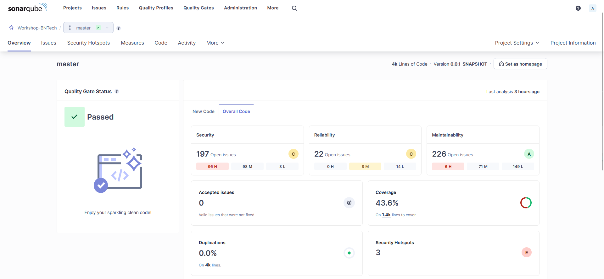

# Workshop BNTech

## Setup de l'environnement

### Création d'une image à partir d'un Dockerfile et démarrage du conteneur

Pour créer une image à partir d'un Dockerfile et démarrer un conteneur, suivez les étapes ci-dessous :

1. Assurez-vous d'avoir Docker installé sur votre machine. Si ce n'est pas le cas, vous pouvez le télécharger et l'installer à partir du site officiel de Docker.

2. Placez-vous dans le répertoire contenant le Dockerfile que vous souhaitez utiliser pour créer l'image.

3. Ouvrez une fenêtre de terminal ou une invite de commande et exécutez la commande suivante pour construire l'image :

    ```shell
    docker build --pull --rm -f "dockerfile" -t workshopbntech:latest "."
    ```

4. Une fois l'image construite, exécutez la commande suivante pour démarrer un conteneur à partir de l'image:

    ```shell
    docker run -d --name workshopbntech -p 9000:9000 workshopbntech:latest
    ```

5. Une fois le conteneur démarré, ouvrez votre navigateur web et rendez-vous à l'adresse [http://localhost:9000](http://localhost:9000).

6. Connectez-vous en utilisant les identifiants suivants : 
   - Nom d'utilisateur : admin
   - Mot de passe : admin

7. Après vous être connecté, vous serez invité à changer votre mot de passe. Suivez les instructions à l'écran pour le modifier.

8. Une fois connecté et votre mot de passe modifié, choisissez de créer un projet local en cliquant sur l'option correspondante.

9. Nommez le projet "Workshop-BNTech" et définissez la branche principale comme étant "master".
    
10. Appuyez sur "Next" et choisissez "Use global settings" dans le nouvel écran, puis cliquez sur "Create project".

11. Ensuite, pour la méthode d'analyse, choisissez "Locally".

12. Laissez le nom du token par défaut et choisissez "Generate".

13. Copiez le token généré et collez-le dans la propriété "sonar.token" du fichier "build.gradle" du projet.

À ce stade nous avons fini de configurer notre serveur SonarQube et allons pouvoir lancer notre première analyse.

### Lancer une analyse sonar

Avant de lancer l'analyse, assurez vous que vous avec bien copié votre token sonar dans le fichier "build.gradle".
Ensuite exécutez la commande suivante dans un terminal ouvert au niveau du projet java:

    ./gradlew test dependencyCheckAnalyze sonar


L'analyse devrait prendre quelques minutes tout au plus à s'exécuter.
Une fois faites, vous pouvez retourner sur la page "overview" de notre serveur sonar, et les données de l'analyse devraient être disponibles.
Vous devriez voir une page qui ressemble à celle-ci:


